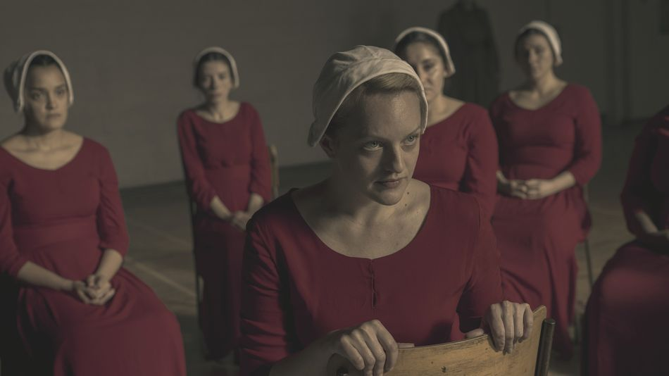

# news-article
an informative article on something interesting

# _The Handmaid's Tale_ has a black people problem and its name is June

This is an excerpt from an article by Alexis Nedd
published on [Mashable](https://mashable.com/article/handmaids-tale-black-women-deaths/)

## Dystopia fiction
Dystopian fiction is by definition a showcase of the worst case scenario.
To write it, creators must take horrible realities and stretch them to their logical,
if pessimistic, conclusion. In a lot of ways _The Handmaid’s Tale_ does dystopia fairly well —
it draws upon modern misogyny, extremist pseudo-Christian ideology,
and observable human rights abuses and imagines a world where all of society is governed by those terms. 

### The problem with writing a dystopia
The problem with writing a dystopia is that worst case scenarios are subjective.
Everyone’s nightmare looks different to the person standing next to them. Margaret Atwood,
who wrote _The Handmaid’s Tale_ book even has a quote that speaks directly to this concept:
“Men are afraid that women will laugh at them. Women are afraid that men will kill them.” 

_The Handmaid’s Tale_ on Hulu follows the worst case scenario for its protagonist June,
a white woman from the Boston area. June is forced into sexual slavery as a Handmaid,
beaten, stripped of her autonomy, and separated from her children. As Season 3
of _The Handmaid’s Tale_ has proven, though, June herself is a walking nightmare
for another kind of person, and her increasingly selfish and entitled behavior has racked
up a very specific body count that indicates a larger problem with her character.

> June keeps getting black people killed. 

## Two straight episodes in Season 3 have ended with Gilead killing black women because
of something June did. 

In Episode 7 “Under His Eye,” a black Martha named Frances risks her life to give June information
about her daughter Hannah’s school and is later hanged for her treason.
June discovers that Ofmatthew, a fellow handmaid who is also black, had informed on Frances and
retaliates by isolating and manipulating Ofmatthew into a mental breakdown.
At the end of Episode 8 “Unfit,” Ofmatthew snaps in the supermarket and is shot. When Guardians
arrive to drag Ofmatthew’s body from the market, June smirks triumphantly, having vanquished the
snitch who, in her eyes, killed Frances. 

The thing is, June killed Frances. And she arguably killed Ofmatthew, too.
Neither of those women would have been hurt if June had put their lives above her
desire to see her daughter. Frances the Martha was keeping an eye on Hannah and
didn’t want to cause any more trouble, but June pestered her until she relented.
June psychologically tortured Ofmatthew for informing on her, but Ofmatthew was
only performing the Handmaid’s duty of mandatory reporting in an effort to stay alive. 

>The pattern of who lives and who dies as a result of her actions is a disturbing
>element that The Handmaid’s Tale either hasn’t noticed or refuses to address.

June doesn’t feel bad for pushing Ofmatthew past her mental limits because she assumes
Ofmatthew is a pompous true believer in Gilead, but the reality of Ofmatthew’s
situation tells a different story. To a more sympathetic eye, Ofmatthew was a woman
who had three children stolen from her and was pregnant with a fourth,
whose fertility nonetheless comes second to her blackness in the eyes of the state
(in another scene, Aunt Lydia remarks that some Commanders refuse Handmaids of color,
which limits Ofmatthew’s opportunities to prove useful). 

**Read the rest of the article [here](https://mashable.com/article/handmaids-tale-black-women-deaths/**)